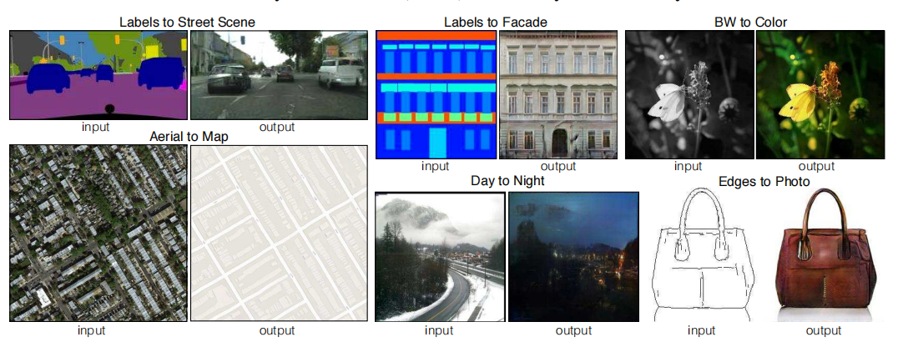
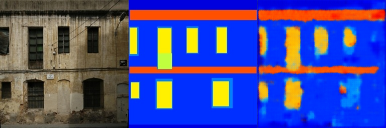
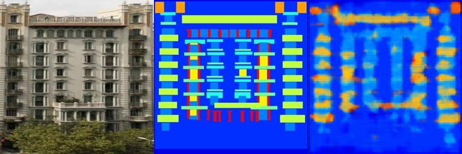
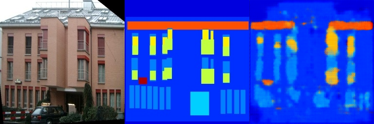
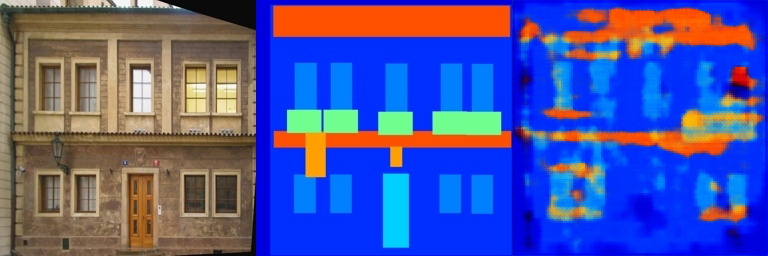
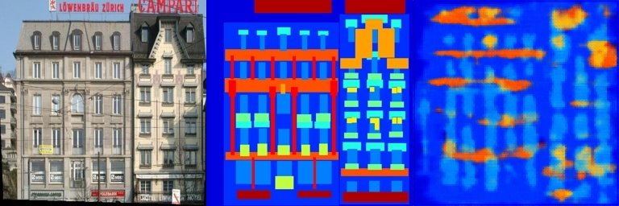
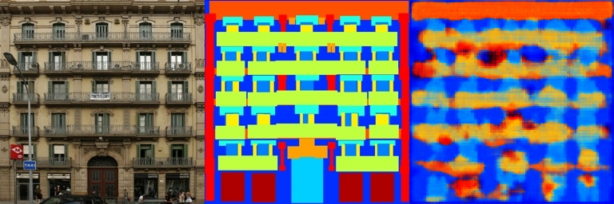

## 原理

能够使用图像（标签图，边缘图，颜色图）合成相关图像，网络能够学习到图像之间的映射以及损失函数。

- GAN: 通过训练生成器与判别器，来使得生成的结果符合现实。

- conditional GANs：是对输入图像附加一个条件，根据条件生成相关的输出图像。

## 网络输入

随机噪声`z`，输入图像`x`，真实结果`y`。损失函数为

## 代码思路

在`FCN_network.py`中，需要添加enconder和decoder层，按照论文中附录的提示，卷积层包括`Convulution-Batch-ReLU`，卷积核`4x4`，stride为2。而decoder层包括`Convulution-BatchNorm-DropOut-ReLU`，添加`dropout`可以防止出现过拟合，但是由于网络深度较浅，没有添加，减少训练时间。最后使用`Tanh`作为激活。

## 结果展示

### Train results

### Val Results

