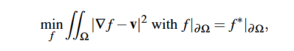
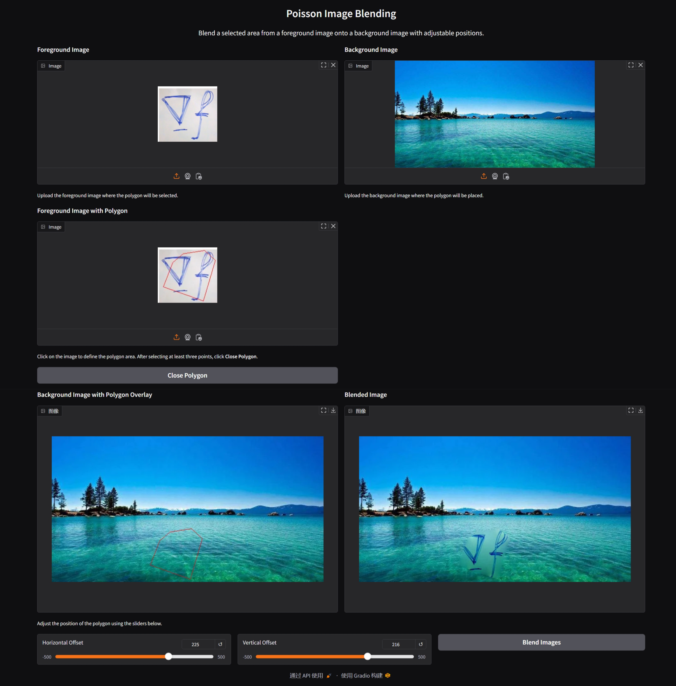

## 原理

Possion Image editting的原理大致来说可以表示为以下公式：

对于图像编辑任务而言，`f`是待求的像素的值；`v`作为guidance field，则是`foreground_img`计算得出的梯度值。我们希望在保持边界为`background_img`值的前提下，使得中间区域的梯度尽可能地相似于`foreground_img`选择区域的梯度值。

## 代码思路 

在实现过程中，利用`mask`构建出选择区域后，再通过构建卷积kernel来简洁的计算出梯度值，最后表达出`loss`函数。而在优化过程中，则使用`pytorch`自带的求解器。从而大大减少了代码量。

## 结果展示

## 一些注意事项

- `fn=lambda img: img`：lambda 函数。input改变，直接传递到output
- `loss`定义为选定多边形区域，每个像素处`foreground_img`和`blended_img`梯度差的模长平方，再最后求和。这是poisson image editting原始论文中公式的离散形式。
- pytorch中，图像通常采用`(batch,channel,height,width)`形式表达。
- 了解基础的卷积操作定义。包括`padding,stride,group,dilation`等参数的意义。
- 使用`torch.optim.Adam`进行迭代优化。
- tensor默认创建在cpu上，需要移动到gpu上才能和gpu上的tensor进行运算。

