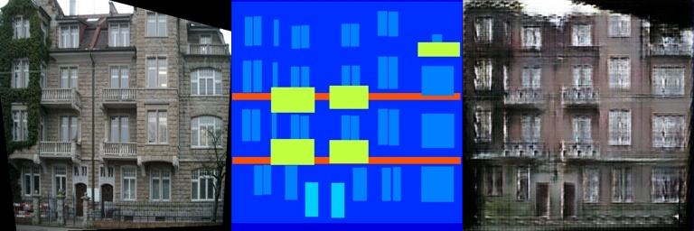
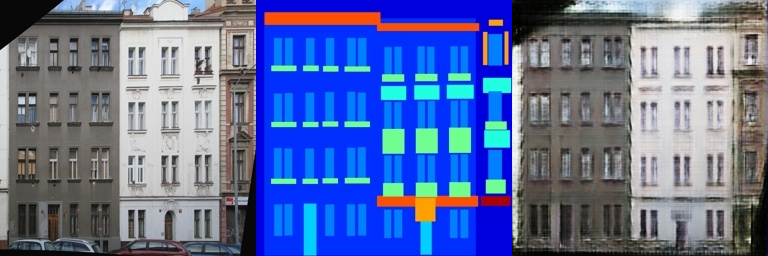
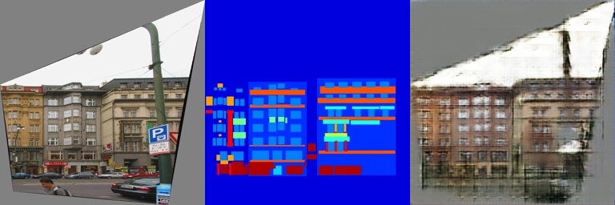

# Pix2Pix 图像翻译实验报告

## 原理
Pix2Pix是基于条件生成对抗网络（cGAN）的图像到图像翻译模型。它通过生成器和判别器的对抗训练，学习从输入图像到目标图像的映射关系。生成器采用U-Net结构，能够保留输入图像的低级特征；判别器使用PatchGAN，对图像的局部区域进行真伪判断。模型通过L1损失保证生成图像与目标图像的像素级相似度，同时通过对抗损失提高生成图像的视觉质量。

## 代码思路
项目代码主要包含四个模块：
1. 数据集模块（facades_dataset.py）：实现FacadesDataset类，负责加载和处理建筑立面图像数据集。
2. 生成器模块（FCN_network.py）：实现全卷积网络，采用编码器-解码器结构，通过跳跃连接保留细节信息。
3. 判别器模块（GAN_network.py）：实现PatchGAN判别器，对图像局部区域进行真伪判断。
4. 训练模块（train.py）：实现训练流程，包括损失计算、反向传播、模型保存等功能。

## 实验结果

| -----                                      | ------                                     |
| ------------------------------------------ | ------------------------------------------ |
|  |  |
|| |

> 因为训练过程中电脑蓝屏了，实际上这是`epoch 150`的结果。可以看到虽然没有完成完整训练，但是已经有了相当不错的效果

## 注意事项

1. 数据集准备：确保train_list.txt和val_list.txt文件路径正确，图像尺寸一致。
2. 训练参数：初始学习率设为0.001，使用Adam优化器，训练800个epoch。
3. 硬件要求：建议使用GPU训练，显存至少4GB。
4. 结果保存：每20个epoch保存一次模型，每5个epoch保存一次生成结果。
5. 可视化：训练过程中会保存输入、输出和真实图像的对比结果，便于观察模型效果。
