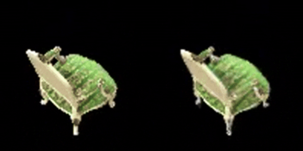

# 3D Gaussian Splatting 实验报告

## 原理
3D Gaussian Splatting通过将3D点扩展为3D高斯分布来实现场景重建。每个3D高斯由位置、颜色、不透明度、协方差矩阵等参数定义。通过将3D高斯投影到2D图像空间，并使用体积渲染技术（$\alpha$ blending）进行渲染。

## 代码思路
1. **初始化**：从Colmap获取的3D点云数据初始化高斯模型
   - 位置：直接使用输入点云坐标
   - 旋转：初始化为单位四元数
   - 缩放：基于K近邻距离计算初始尺度
   - 颜色：将RGB值转换到logit空间
   - 不透明度：初始化为接近1的值

2. **协方差计算**：
   - 将四元数转换为旋转矩阵R
   - 将log尺度转换为对角矩阵S
   - 计算协方差矩阵：Cov = R*S*S^T*R^T

3. **参数获取**：
   - 通过sigmoid函数获取颜色和不透明度
   - 通过指数函数获取实际尺度
   - 返回包含所有参数的GaussianParameters对象

## 实验结果

- Input/Output

## 注意事项
1. 尺度初始化时需限制最小和最大值，防止数值不稳定
2. 颜色和不透明度使用logit空间表示，便于优化
3. 四元数需要归一化以保证旋转矩阵的正确性
4. 协方差计算涉及矩阵乘法，需注意维度匹配
